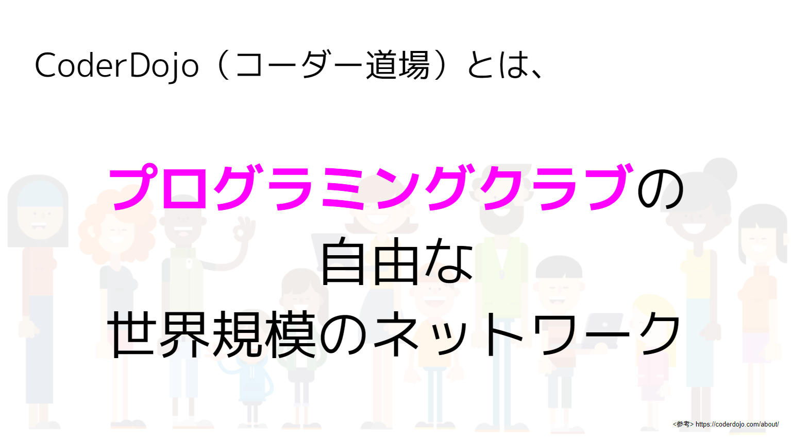
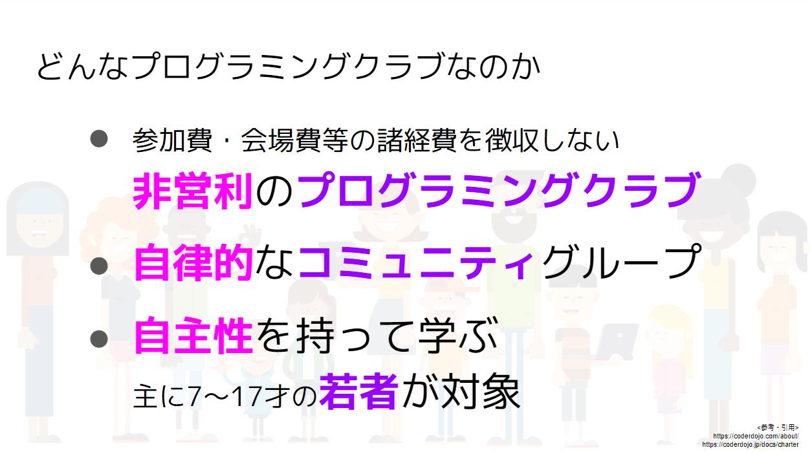
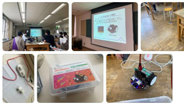
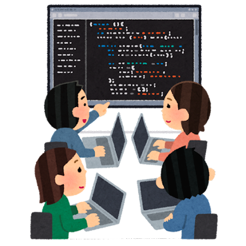
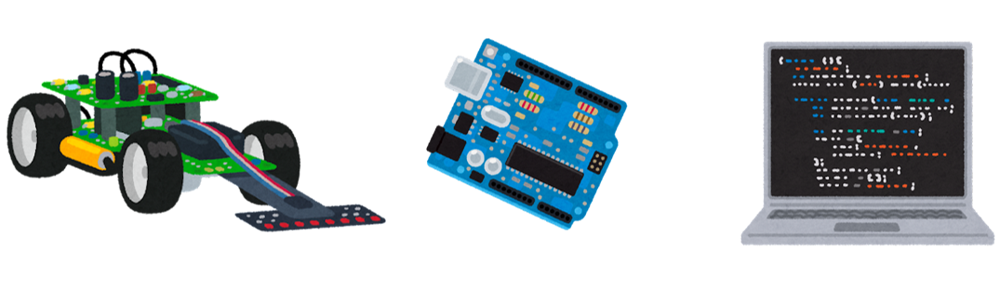

# <!--fit--> CoderDojo 浜松へようこそ

---

## CoderDojoとは ?

---

### CoderDojoとは ?

---

### CoderDojoとは ?

---

## CoderDojo浜松とは ?

---

### CoderDojo浜松とは ?

CoderDojo 浜松は、2016年から月に1回ペースで
道場を開いています。

---

### CoderDojo浜松とは ?

主に次のようなことをやっています。

- Scratch というブロック・プログラミング環境による作品制作
- micro:bit などのマイコンボードのプログラミング
- Python/ JavaScript / Unity などをつかったプログラミング

---

中略

---

### ちょっとお願い

1. CoderDojoの活動を広く知らせていくために、Dojoでの様子の写真をWeb Pageなどに公開することがあります。もし、撮影の際に写さないで欲しいという要望がありましたら、事前にメンターやボランティアまでお知らせください。
2. CoderDojoでは参加費は徴収しませんが、継続的に活動を続けていくために募金を集めています。ワンコイン100円で良いので、ぜひご協力のほどよろしくお願いします。

---

## さあ、やってみよう！

